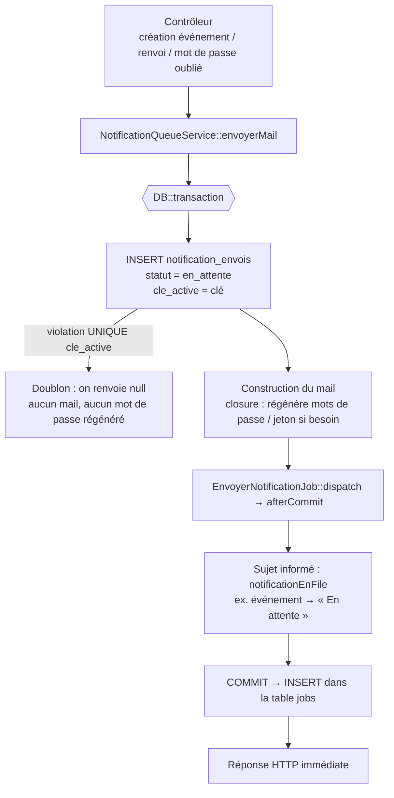
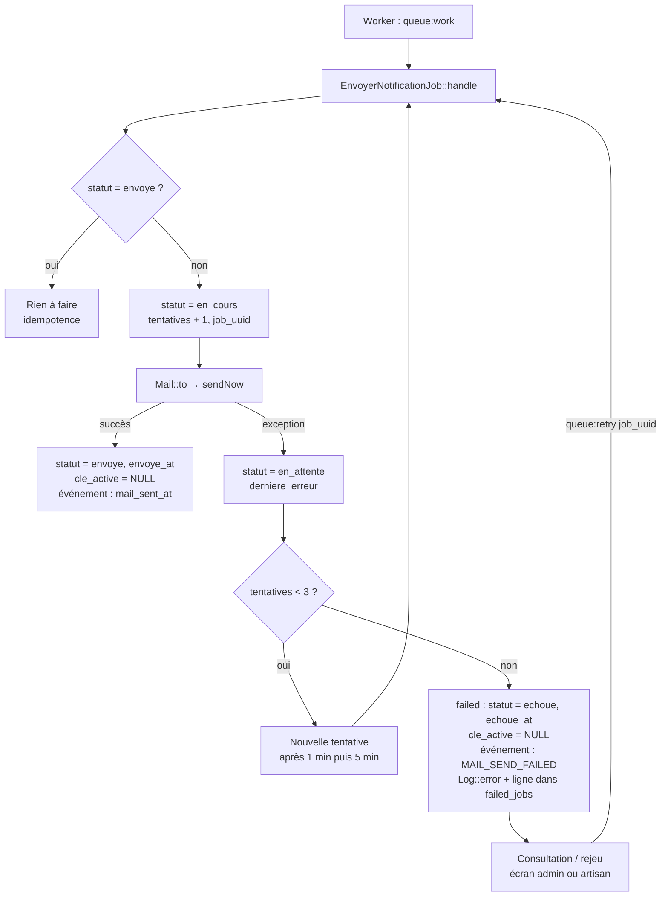

# File d'attente des notifications

> Issue : #14 « Mettre les notifications dans une file d'attente »
> Branche : `feature/14-notifications-file-attente`
> Date : 28/09/2026

Ce document décrit le système de file d'attente mis en place pour les notifications (e-mails) : son fonctionnement, les choix techniques, les fichiers modifiés, l'exploitation (worker, rejeu, consultation des échecs), les tests et les limites connues.

---

## 1. Résumé

**Avant :** les e-mails étaient envoyés **pendant la requête HTTP** (`Mail::to(...)->send(...)`). La requête attendait le serveur SMTP : si le SMTP était lent, l'utilisateur attendait ; s'il était en panne, l'envoi était perdu (seule une trace `MAIL_SEND_FAILED` restait sur l'événement) et il n'existait ni nouvelle tentative automatique, ni vue d'ensemble des échecs.

**Après :** chaque notification est :

1. **enregistrée** dans la table `notification_envois` (statut `en_attente`) ;
2. **poussée dans la file `notifications`** sous forme d'un job `EnvoyerNotificationJob` (une simple insertion en base : la requête répond immédiatement) ;
3. **envoyée par le worker** (`php artisan queue:work`) en arrière-plan ;
4. **relancée automatiquement** en cas d'erreur (3 tentatives : après 1 min, puis 5 min) ;
5. marquée **définitivement échouée** si toutes les tentatives échouent, puis **consultable et rejouable** depuis l'écran *Notifications* de l'administration ou en ligne de commande.

Deux notifications identiques ne peuvent pas être en file en même temps (**déduplication**), et un job livré deux fois n'envoie jamais le mail deux fois (**idempotence**).

Notifications concernées :

| Notification | Type (`notification_envois.type`) | Clé de déduplication |
|---|---|---|
| Mail d'accès après création d'un événement (identifiants organisateur + scanneur) | `evenement.creation` | `evenement:{id}:acces` |
| Renvoi du mail d'accès depuis la liste des événements | `evenement.renvoi` | `evenement:{id}:acces` |
| Lien « mot de passe oublié » | `auth.reinitialisation_mot_de_passe` | `user:{id}:reinitialisation-mot-de-passe` |

---

## 2. Correspondance avec les conditions d'acceptation

| Condition d'acceptation | Implémentation | Test (`tests/Feature/Notification/FileAttenteNotificationTest.php`) |
|---|---|---|
| Les notifications sont ajoutées à une file d'attente | `NotificationQueueService::envoyerMail()` crée la trace et pousse `EnvoyerNotificationJob` sur la file `notifications` | `test_la_creation_d_evenement_met_le_mail_en_file_sans_l_envoyer_pendant_la_requete`, `test_le_mot_de_passe_oublie_est_mis_en_file`, `test_l_api_indique_que_le_mail_est_en_file_d_attente` |
| Les e-mails sont traités de manière asynchrone | `EnvoyerNotificationJob` (`ShouldQueue`) exécuté par le worker | `test_le_worker_envoie_le_mail_et_trace_le_succes` |
| La requête utilisateur ne reste pas bloquée par l'envoi | Pendant la requête : insertion en base uniquement, aucun appel SMTP | `test_une_panne_smtp_ne_bloque_pas_la_requete` (SMTP en panne → la requête réussit quand même) |
| Les tâches échouées sont identifiées | Statut, nombre de tentatives, dernière erreur et date d'échec dans `notification_envois` ; `failed_jobs` pour les autres tâches ; journalisation `Log::error` | `test_une_tentative_echouee_est_identifiee_puis_relancee_par_le_worker`, `test_apres_la_derniere_tentative_la_notification_est_definitivement_echouee` |
| Un mécanisme de retry est disponible | Automatique : `$tries = 3` + `backoff()` ; manuel : bouton « Rejouer », `php artisan notifications:rejouer` | `test_une_notification_echouee_peut_etre_rejouee`, `test_l_admin_rejoue_une_notification_depuis_l_ecran`, `test_la_commande_artisan_liste_et_rejoue_les_notifications_echouees` |
| Les tâches définitivement échouées peuvent être consultées | Écran `/admin/notifications` (filtre « Échoué ») + section « Autres tâches échouées » ; `notifications:rejouer --lister` | `test_l_admin_consulte_les_notifications_et_les_taches_echouees` |
| Le système évite les doublons de notification | Index `UNIQUE` sur `cle_active` + idempotence du job + mots de passe/jetons générés seulement si la notification n'est pas un doublon | `test_un_renvoi_est_refuse_tant_qu_un_mail_d_acces_est_en_file`, `test_deux_demandes_de_mot_de_passe_oublie_ne_creent_qu_une_notification`, `test_un_job_deja_envoye_n_envoie_pas_de_doublon`, `test_la_meme_cle_est_refusee_puis_acceptee_une_fois_terminee` |
| *Règle :* le système doit disposer d'un worker | `php artisan queue:work --queue=notifications,default` (voir § 6) ; script `composer dev` mis à jour | vérifié manuellement (§ 8) |
| *Règle :* une notification ne doit pas bloquer la requête principale | cf. ci-dessus | idem |

---

## 3. Flux

### 3.1 Mise en file (pendant la requête HTTP)



### 3.2 Traitement (dans le worker)



### 3.3 Cycle de vie d'une notification

```
en_attente ──► en_cours ──► envoye
    ▲             │
    │ (tentative  │ (dernière tentative
    │  échouée)   │  échouée)
    └─────────────┤
                  ▼
               echoue ──(rejouer)──► en_attente
```

---

## 4. Choix techniques

### 4.1 File `database` de Laravel

Le projet utilisait déjà `QUEUE_CONNECTION=database` (tables `jobs` et `failed_jobs` présentes, job `RegenerateTicketPdfJob` existant). Nous restons sur ce pilote : aucune infrastructure supplémentaire (Redis…) n'est nécessaire. Les notifications utilisent une **file dédiée `notifications`** afin de pouvoir les prioriser ou leur réserver un worker.

### 4.2 Une table de suivi `notification_envois`

La table `failed_jobs` de Laravel ne suffit pas : elle ne contient que les échecs définitifs, avec un payload illisible (chiffré, voir 4.4). La table `notification_envois` donne une vue métier de **toutes** les notifications :

| Colonne | Rôle |
|---|---|
| `type` | identifiant fonctionnel (`evenement.creation`…) |
| `canal` | `mail` (prévu pour d'autres canaux : SMS, push…) |
| `destinataire` | adresse e-mail |
| `cle` | clé de déduplication (historique) |
| `cle_active` | copie de `cle` **tant que la notification est en attente ou en cours**, `NULL` ensuite — index `UNIQUE` |
| `statut` | `en_attente`, `en_cours`, `envoye`, `echoue` |
| `sujet_type` / `sujet_id` | modèle concerné (relation polymorphe, ex. l'événement ou l'utilisateur) |
| `tentatives` | nombre de tentatives effectuées |
| `derniere_erreur` | classe + message de la dernière exception (1000 caractères max.) |
| `job_uuid` | UUID du job Laravel : permet de retrouver la ligne de `failed_jobs` pour le rejeu |
| `envoye_at` / `echoue_at` | dates de fin |

### 4.3 Déduplication par index `UNIQUE` sur `cle_active`

Un simple `SELECT` avant `INSERT` laisserait passer deux requêtes simultanées (double-clic). L'index `UNIQUE` sur `cle_active` garantit en base qu'**une seule notification d'une même clé est active à la fois**, sans verrou applicatif. Comme `cle_active` repasse à `NULL` en fin de vie (plusieurs `NULL` sont autorisés par un index unique sous MySQL, SQLite et PostgreSQL), un nouvel envoi redevient possible une fois le précédent terminé (ex. : renvoyer le mail d'accès une semaine plus tard).

**Pourquoi la clé est partagée entre création et renvoi (`evenement:{id}:acces`) :** le renvoi régénère les mots de passe. Si un renvoi était accepté alors que le mail de création est encore en file, celui-ci partirait avec des mots de passe déjà invalides. Le renvoi est donc refusé tant qu'un mail d'accès est en attente (« Un mail d'accès est déjà en cours d'envoi pour cet événement »).

**Pourquoi le mail est construit dans une closure :** `envoyerMail()` accepte une closure qui n'est exécutée **qu'après** la réservation de la clé. Ainsi, pour un doublon, les mots de passe du renvoi ne sont pas régénérés et aucun nouveau jeton de réinitialisation n'est créé : le mail déjà en file reste valide.

**Idempotence du job :** si un job est exécuté alors que sa notification est déjà `envoye` (job livré deux fois, `queue:retry` lancé à la main par erreur), il ne fait rien.

### 4.4 Job chiffré (`ShouldBeEncrypted`)

Les mails d'accès contiennent des **mots de passe temporaires** et le mail « mot de passe oublié » un **jeton de réinitialisation**. Sans précaution, ils seraient stockés en clair dans les tables `jobs` et `failed_jobs`. `EnvoyerNotificationJob` implémente `ShouldBeEncrypted` : son contenu est chiffré avec `APP_KEY`. Vérifié manuellement : le secret n'apparaît pas dans le payload (§ 8).

> ⚠️ Conséquence : si `APP_KEY` change, les jobs en attente ou échoués ne peuvent plus être déchiffrés.

### 4.5 `afterCommit()`

Le job est poussé **après le commit** de la transaction. Le worker ne peut donc jamais traiter un job dont la notification (ou les mots de passe régénérés) n'est pas encore visible en base, et un rollback n'envoie aucun mail.

### 4.6 Tentatives et délais

`EnvoyerNotificationJob::$tries = 3` et `backoff() = [60, 300, 900]` (configurables, § 6.3). Le nombre de tentatives est porté par le job lui-même : il prévaut sur l'option `--tries` du worker.

### 4.7 Suivi métier via l'interface `SuitLesNotifications`

Le modèle concerné par une notification peut implémenter `App\Contracts\SuitLesNotifications` pour réagir à son cycle de vie. `Evenement` l'implémente pour conserver les colonnes existantes (`mail_sent_at`, `last_mail_error`, `mail_send_attempts`) et donc l'affichage existant de la liste des événements :

| Événement de la notification | Effet sur l'événement | Affichage liste |
|---|---|---|
| `notificationEnFile` | `mail_sent_at = NULL`, `last_mail_error = NULL` | « En attente » |
| `notificationEnvoyee` | `mail_sent_at = now()`, `mail_send_attempts + 1` | « Envoyé » |
| `notificationEchouee` | `last_mail_error = MAIL_SEND_FAILED` (création) ou `MAIL_RESEND_FAILED` (renvoi), `mail_send_attempts + 1` | « Échec » |

### 4.8 Rejeu

Le rejeu d'une notification définitivement échouée réutilise le **job d'origine** conservé dans `failed_jobs` (`php artisan queue:retry <job_uuid>`) : le mail renvoyé est exactement celui qui avait été préparé. Avant de rejouer, le service vérifie :

1. que la notification est bien au statut `echoue` ;
2. que sa ligne existe encore dans `failed_jobs` ;
3. qu'**aucune notification plus récente de même clé** n'a été envoyée ou n'est en cours (sinon elle est **obsolète** : par exemple un renvoi a déjà transmis de nouveaux mots de passe, rejouer l'ancien mail enverrait des identifiants périmés) ;
4. qu'aucune notification de même clé n'est déjà en file (index `UNIQUE`).

---

## 5. Fichiers créés et modifiés

### Créés

| Fichier | Rôle |
|---|---|
| `database/migrations/2026_09_28_100000_create_notification_envois_table.php` | Table de suivi des notifications |
| `app/Models/NotificationEnvoi.php` | Modèle + constantes de statut + transitions (`marquerEnCours`, `marquerEnvoyee`, `marquerTentativeEchouee`, `marquerEchouee`) |
| `app/Contracts/SuitLesNotifications.php` | Interface permettant à un modèle de suivre ses notifications |
| `app/Jobs/EnvoyerNotificationJob.php` | Job d'envoi (chiffré, 3 tentatives, backoff, idempotent, `failed()`) |
| `app/Services/NotificationQueueService.php` | Mise en file avec déduplication (`envoyerMail`), rejeu (`rejouer`, `rejouerTache`) |
| `app/Services/MailDejaEnFileException.php` | Exception levée par un renvoi en doublon |
| `app/Console/Commands/RejouerNotificationsCommand.php` | Commande `notifications:rejouer` |
| `app/Http/Controllers/Web/Admin/NotificationController.php` | Écran de consultation et actions de rejeu |
| `routes/notification.php` | Routes `admin.notifications.*` (admins, actions tracées par `AuditTrail`) |
| `resources/views/admin/notifications/index.blade.php` | Écran « File d'attente des notifications » |
| `config/notifications.php` | Nom de la file, tentatives, délais |
| `tests/Feature/Notification/FileAttenteNotificationTest.php` | 20 tests de la fonctionnalité |

### Modifiés

| Fichier | Modification |
|---|---|
| `app/Services/EvenementMailService.php` | Met les mails en file au lieu de les envoyer ; `renvoyer()` régénère les mots de passe seulement si la notification n'est pas un doublon et lève `MailDejaEnFileException` sinon ; suppression de `tracer()` (remplacé par `SuitLesNotifications`) |
| `app/Models/Evenement.php` | Implémente `SuitLesNotifications` ; relation `notificationEnvois()` |
| `app/Http/Controllers/Web/Admin/EvenementController.php` | Messages « envoi en file d'attente » ; gestion du doublon au renvoi |
| `app/Http/Controllers/Api/V1/EvenementController.php` | Nouveau champ `mail_en_file_attente` (le champ `mail_envoye` est conservé pour compatibilité, même valeur) |
| `app/Http/Controllers/Auth/PasswordResetLinkController.php` | Lien de réinitialisation mis en file, dédupliqué par utilisateur |
| `resources/views/layouts/main.blade.php` | Entrée de menu « Notifications » (section Pilotage) |
| `routes/web.php` | Inclusion de `routes/notification.php` |
| `composer.json` | `composer dev` : le worker écoute `--queue=notifications,default` |
| `.env.example` | Variables `NOTIFICATIONS_*` |

---

## 6. Exploitation

### 6.1 Déploiement

```bash
php artisan migrate
php artisan config:cache   # si la configuration est mise en cache en production
```

Vérifier dans `.env` :

```dotenv
QUEUE_CONNECTION=database   # surtout pas "sync" en production (voir § 9)
```

### 6.2 Lancer le worker

Le worker **doit** tourner en permanence, sinon les e-mails restent en attente.

```bash
php artisan queue:work --queue=notifications,default --sleep=3
```

- `--queue=notifications,default` : traite d'abord les notifications, puis les autres tâches (ex. génération des billets PDF). **Oublier `notifications` = aucun mail envoyé.**
- En développement : `composer dev` lance déjà le worker avec la bonne option.
- Après chaque déploiement : `php artisan queue:restart` (le worker garde l'ancien code en mémoire).

**Production Linux (Supervisor)** — `/etc/supervisor/conf.d/ticket-worker.conf` :

```ini
[program:ticket-worker]
process_name=%(program_name)s_%(process_num)02d
command=php /chemin/vers/ticket_gestion/artisan queue:work --queue=notifications,default --sleep=3 --max-time=3600
autostart=true
autorestart=true
stopasgroup=true
killasgroup=true
user=www-data
numprocs=1
redirect_stderr=true
stdout_logfile=/chemin/vers/ticket_gestion/storage/logs/worker.log
stopwaitsecs=3600
```

**Hébergement sans Supervisor (mutualisé)** — tâche cron toutes les minutes :

```cron
* * * * * cd /chemin/vers/ticket_gestion && php artisan queue:work --queue=notifications,default --stop-when-empty --max-time=55 >> /dev/null 2>&1
```

**Windows / WAMP (développement)** : laisser une console ouverte avec `php artisan queue:work --queue=notifications,default`.

### 6.3 Configuration (`config/notifications.php`)

| Variable `.env` | Défaut | Rôle |
|---|---|---|
| `NOTIFICATIONS_QUEUE` | `notifications` | Nom de la file (le worker doit l'écouter) |
| `NOTIFICATIONS_TENTATIVES` | `3` | Nombre total de tentatives avant échec définitif |
| `NOTIFICATIONS_BACKOFF` | `60,300,900` | Délais en secondes entre les tentatives |

### 6.4 Consulter les notifications et les échecs

**Interface :** menu *Pilotage → Notifications* (`/admin/notifications`, réservé aux administrateurs) :

- compteurs par statut (cliquables) ;
- filtres par statut, type et destinataire ;
- pour chaque notification : type, destinataire, statut, date, nombre de tentatives, dernière erreur ;
- bouton **Rejouer** sur les notifications échouées ;
- section **Autres tâches échouées** : les autres jobs de `failed_jobs` (ex. `RegenerateTicketPdfJob`), avec la première ligne de l'erreur et un bouton **Rejouer**.

Les actions de rejeu sont tracées dans le journal d'audit.

**Ligne de commande :**

```bash
php artisan notifications:rejouer --lister     # notifications définitivement échouées
php artisan notifications:rejouer 12 15        # rejouer les notifications 12 et 15
php artisan notifications:rejouer --tous       # rejouer toutes les notifications échouées
php artisan queue:failed                       # toutes les tâches échouées (Laravel)
php artisan queue:monitor database:notifications --max=100   # alerte si la file grossit
```

### 6.5 Que faire si des e-mails ne partent pas ?

1. Les notifications restent « En attente » → **le worker ne tourne pas** ou n'écoute pas la file `notifications`.
2. Les notifications passent « Échoué » → lire la colonne *Dernière erreur* (souvent la configuration SMTP : `MAIL_HOST`, `MAIL_PORT`, identifiants), corriger, puis **Rejouer**.
3. « La tâche d'origine est introuvable » → la ligne `failed_jobs` a été purgée ; utiliser le bouton métier (ex. « Renvoyer le mail » de la liste des événements).

---

## 7. Utilisation pour une nouvelle notification

```php
use App\Services\NotificationQueueService;

public function __invoke(NotificationQueueService $notifications)
{
    $notification = $notifications->envoyerMail(
        type: 'transaction.confirmation',
        destinataire: $client->email,
        cle: 'transaction:' . $transaction->id . ':confirmation',
        mailable: new ConfirmationPaiementMail($transaction), // ou une closure
        sujet: $transaction,                                   // facultatif
    );

    if ($notification === null) {
        // doublon : une notification identique est déjà en file
    }
}
```

Règles :

- **Ne plus appeler `Mail::to(...)->send(...)` dans une requête HTTP** : passer par `NotificationQueueService`.
- Choisir une clé qui identifie « le même message pour le même destinataire/objet ».
- Utiliser une **closure** si construire le mail a un effet de bord (générer un mot de passe, un jeton…).
- Le modèle `sujet` peut implémenter `SuitLesNotifications` pour suivre l'envoi.

---

## 8. Tests

```bash
php artisan test tests/Feature/Notification
php artisan test
```

**Nouveaux tests** (`tests/Feature/Notification/FileAttenteNotificationTest.php`, 20 tests) :

| Groupe | Tests |
|---|---|
| Mise en file / non-blocage | création d'événement (web et API), mot de passe oublié, panne SMTP sans impact sur la requête |
| Worker | job chiffré et configuré (3 tentatives, backoff, file), envoi et traçage du succès, idempotence, tentative échouée identifiée et relancée, échec définitif |
| Déduplication | renvoi refusé pendant qu'un mail est en file (et mots de passe non régénérés), renvoi accepté après envoi, double demande de mot de passe oublié → 1 notification et 1 jeton, clé refusée puis acceptée |
| Rejeu | rejeu d'une notification échouée, refus pour une notification non échouée, refus pour une notification obsolète, commande artisan |
| Consultation | écran admin (notifications + autres tâches échouées), rejeu depuis l'écran, accès refusé aux non-administrateurs |

**Tests existants :** tous restent verts. En test, `QUEUE_CONNECTION=sync` (`phpunit.xml`) : le job s'exécute immédiatement, donc les tests existants (`Mail::assertSent`, `mail_sent_at`, `MAIL_SEND_FAILED`) fonctionnent sans modification.

**Vérification manuelle avec un vrai worker** (file `database`) :

- mise en file → le payload dans `jobs` ne contient **pas** le secret en clair, file = `notifications` ;
- `queue:work --once` → notification `envoye`, `tentatives = 1` ;
- SMTP injoignable → 3 tentatives (`FAIL` ×3), notification `echoue` avec l'erreur `TransportException`, ligne dans `failed_jobs` ;
- `notifications:rejouer --tous` → notification `en_attente`, `failed_jobs` vidé, job de nouveau dans `jobs`.

---

## 9. Limites connues et pistes

- **Worker obligatoire :** sans worker, les mails restent en attente indéfiniment. Surveiller la file (`queue:monitor`) ou l'écran *Notifications*.
- **`QUEUE_CONNECTION=sync` :** l'envoi redevient synchrone (utile uniquement en test). Un échec SMTP est alors tracé tout de suite (`echoue`) sans nouvelle tentative.
- **Rotation d'`APP_KEY` :** les jobs en attente/échoués chiffrés avec l'ancienne clé deviennent illisibles.
- **Mail « mot de passe oublié » rejoué tardivement :** le jeton expire au bout de 60 minutes ; rejouer un échec plus ancien envoie un lien expiré. Mieux vaut que l'utilisateur refasse une demande.
- **Purge :** `failed_jobs` et `notification_envois` grossissent. Pistes : planifier `php artisan queue:prune-failed --hours=720` et une purge des notifications `envoye` de plus de N mois.
- **Hors périmètre :** l'alerte envoyée aux administrateurs par `RegenerateTicketPdfJob::failed()` part déjà depuis le worker (donc sans bloquer de requête) et n'a pas été migrée vers `notification_envois`. Le mailable `DemandeEvent` n'est utilisé nulle part.
- **Autres canaux :** la colonne `canal` est prête pour des SMS/push, mais seul le canal `mail` est implémenté.
