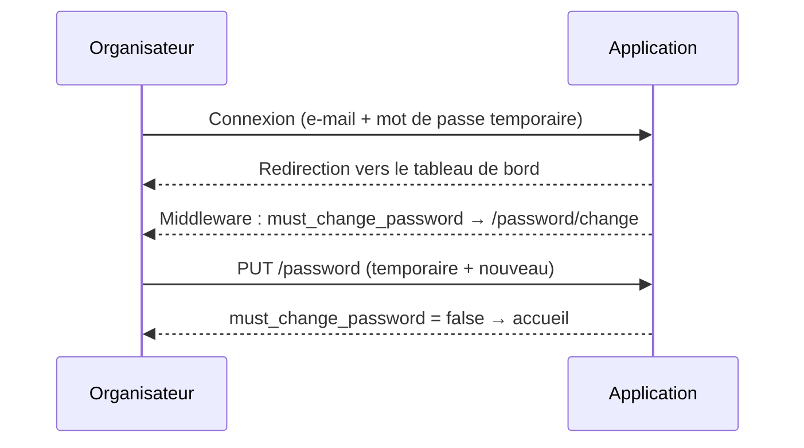

# Plusieurs événements pour un même organisateur

> Branche : `feature/Gerer-la-creation-de-plusieurs-evenements-pour-un-meme-organisateur`
> Date : 26/09/2026

Ce document décrit comment un organisateur peut créer plusieurs événements avec le même compte : le fonctionnement, les choix techniques, les fichiers modifiés, les tests, le déploiement et les limites connues.

---

## 1. Résumé

**Avant :** chaque création d'événement créait systématiquement un nouveau compte organisateur. La règle `unique:users,email` bloquait donc toute création avec un e-mail déjà inscrit (« The email has already been taken »). Un organisateur ne pouvait pas avoir deux événements.

**Après :** l'**adresse e-mail** identifie l'organisateur.

| Situation | Ce que fait le système |
|---|---|
| **Cas 1 : e-mail inconnu** | Crée le compte organisateur avec un **mot de passe temporaire**, oblige à le **changer** à la première connexion, crée l'événement et un **scanneur dédié**, puis envoie un e-mail avec les identifiants, l'avertissement de changement de mot de passe, les infos de l'événement et les identifiants du scanneur. |
| **Cas 2 : e-mail d'un organisateur existant** | **Réutilise** le compte (nom et téléphone ne sont pas redemandés), crée l'événement et un **nouveau scanneur**, affiche « Votre événement a été créé avec succès », puis envoie les infos de l'événement et les identifiants du scanneur. Le mot de passe de l'organisateur n'est **pas** modifié. |
| E-mail utilisé par un admin ou un scanneur | La création est **refusée** avec une erreur de validation sur le champ e-mail. |

Dans tous les cas, la création de l'organisateur, de l'événement et du scanneur est **atomique** : soit tout est créé, soit rien.

---

## 2. Correspondance avec les conditions d'acceptation

| Condition d'acceptation | Implémentation | Test |
|---|---|---|
| Un nouvel organisateur peut créer un événement | `EvenementCreationService::resolveOrganisateur()` (cas 1) | `test_nouvel_organisateur_compte_evenement_et_scanneur_crees` |
| Son compte est automatiquement créé | Création de `User` (rôle `organisateur`) et de `Organisateur` | idem |
| Un mot de passe temporaire est généré | `Str::password(12)`, chiffres et lettres | idem (le mot de passe envoyé correspond au hash stocké) |
| Un e-mail avec les informations de connexion est envoyé | `EnvoiMotDePasseMail` via `EvenementMailService` | idem (`Mail::assertSent`) |
| Le changement du mot de passe est demandé | Colonne `users.must_change_password`, middleware `EnsurePasswordIsChanged`, page `/password/change` | `test_mot_de_passe_temporaire_force_le_changement` |
| Le compte scanneur est automatiquement créé | `EvenementCreationService::createScanneur()` | tests des cas 1 et 2 |
| Les identifiants du scanneur sont communiqués | Dans l'e-mail, dans un encadré après redirection (web) et dans le JSON `credentials` (API) | `assertSessionHas('scanneur_credentials')`, tests API |
| Un organisateur existant peut créer un deuxième événement | Cas 2 de `resolveOrganisateur()` | `test_organisateur_existant_cree_un_deuxieme_evenement_sans_nouveau_compte` |
| Les informations déjà enregistrées ne sont pas redemandées | Nom et téléphone deviennent facultatifs si l'e-mail est connu (`Rule::requiredIf`) ; le formulaire les masque automatiquement | idem, et `test_lookup_organisateur` |
| Un nouveau scanneur est créé pour le deuxième événement | Un scanneur est créé à chaque événement | idem (`scanneur_id` différent) |
| Aucun second compte organisateur n'est créé pour le même e-mail | Recherche insensible à la casse et aux espaces, `lockForUpdate`, contrainte `UNIQUE` en base et nouvelle tentative | idem (`'  ORGA@example.com '`), `test_api_indique_si_l_organisateur_existait` |
| Atomicité | `DB::transaction` ; l'affiche est supprimée en cas d'échec | `test_creation_atomique_rien_n_est_cree_en_cas_d_echec` |
| Identifiants du scanneur uniques | Génération avec vérification d'unicité et contrainte `UNIQUE` sur `users.email` | `test_chaque_evenement_a_un_scanneur_aux_identifiants_uniques` |

---

## 3. Flux de création

```mermaid
flowchart TD
    A[Formulaire web / API POST /api/v1/evenements] --> B[StoreEvenementRequest<br/>validation]
    B -->|e-mail d'un admin/scanneur| X[Erreur 422 / retour formulaire]
    B --> C[EvenementCreationService::create]
    C --> D[Stockage de l'affiche]
    D --> T{{DB::transaction}}
    T --> E{Utilisateur avec cet e-mail ?<br/>LOWER(email), lockForUpdate}
    E -->|Non : cas 1| F[Créer User organisateur<br/>mot de passe temporaire<br/>must_change_password = true]
    E -->|Oui, rôle organisateur : cas 2| G[Réutiliser le compte<br/>Organisateur::firstOrCreate]
    F --> H[Créer le Scanneur dédié<br/>e-mail unique]
    G --> H
    H --> I[Créer l'Evenement + Ressource + types de billets]
    I -->|aucun billet valide / erreur| R[ROLLBACK + suppression de l'affiche]
    I --> K[COMMIT]
    K --> M[EvenementMailService::envoyerApresCreation]
    M -->|cas 1| M1[EnvoiMotDePasseMail]
    M -->|cas 2| M2[EvenementCreeMail]
    M1 --> Z[Suivi : mail_send_attempts, mail_sent_at, last_mail_error]
    M2 --> Z
```

**Pourquoi l'e-mail est envoyé après le COMMIT.** Un échec d'envoi (SMTP indisponible) ne doit pas annuler la création. L'événement est créé, l'erreur est tracée (`last_mail_error = MAIL_SEND_FAILED`), et l'admin peut renvoyer le mail depuis le tableau des événements.

---

## 4. Détails techniques

### 4.1 Base de données

Nouvelle migration : `database/migrations/2026_09_26_100000_add_must_change_password_to_users_table.php`

| Colonne | Type | Défaut | Rôle |
|---|---|---|---|
| `users.must_change_password` | boolean | `false` | `true` quand l'utilisateur se connecte avec un mot de passe temporaire |

Le schéma existant convenait déjà au multi-événements :
- `evenements.organisateur_id` : relation 1-N, avec `Organisateur::evenements()` en `hasMany` ;
- `evenements.scanneur_id` : un scanneur par événement, avec `Scanneur::evenement()` en `hasOne` ;
- `users.email` : `UNIQUE`, ce qui empêche en base la création de deux comptes avec le même e-mail.

> **Interprétation de la règle « Un événement ne doit pas être limité à un seul organisateur ».** Nous l'avons lue comme « un organisateur ne doit pas être limité à un seul événement », ce qui est cohérent avec le titre et les autres règles. Le modèle reste donc *un événement = un organisateur*. Si l'intention réelle est d'avoir **plusieurs organisateurs sur un même événement**, il faudra une table pivot `evenement_organisateur`. Ce changement plus lourd touche aussi les tableaux de bord, les billets et les retraits.

### 4.2 `App\Services\EvenementCreationService`

Point d'entrée unique, utilisé par le contrôleur web admin et par l'API.

Valeur de retour de `create(array $validated, bool $createScanneur = true)` :

```php
[
    'evenement'             => Evenement,
    'organisateur'          => ?Organisateur,
    'organisateur_existant' => bool,     // true = cas 2
    'organisateur_code'     => ?string,  // mot de passe temporaire (cas 1 uniquement), sinon null
    'scanneur_code'         => ?string,  // mot de passe du scanneur
    'scanneur_email'        => ?string,  // identifiant du scanneur
]
```

Points importants :

1. **Normalisation de l'e-mail.** `normalizeEmail()` fait `trim` puis passe en minuscules, et la recherche utilise `LOWER(email) = ?`. Ainsi `Orga@Mail.com ` et `orga@mail.com` désignent le même compte.
2. **Verrou.** `lockForUpdate()` sur la recherche de l'utilisateur limite les créations concurrentes (MySQL). Si deux requêtes simultanées créent quand même le même e-mail, la contrainte `UNIQUE` lève une `UniqueConstraintViolationException`. Le service relance alors **une fois** la transaction, qui tombe dans le cas 2 et réutilise le compte créé par l'autre requête.
3. **Rôle.** Si l'e-mail appartient à un compte `admin` ou `scanneur`, une `ValidationException` est levée sur `email_organisateur`, pour ne jamais rattacher un événement à un compte non organisateur.
4. **Données existantes non écrasées.** Dans le cas 2, le nom et le téléphone enregistrés sont conservés. Le téléphone saisi n'est utilisé que si l'organisateur n'en avait pas.
5. **Organisateur sans ligne `organisateurs`.** Si un `User` de rôle organisateur existe sans ligne associée (donnée historique), `Organisateur::firstOrCreate` la crée.
6. **Scanneur.**
   - E-mail au format `scan-<slug-evenement>-<6 caractères aléatoires>@<SCANNEUR_EMAIL_DOMAIN>`, par exemple `scan-concert-de-test-k3x9qa@scanneur.kimiaticket.com` ;
   - l'unicité est vérifiée en base avant l'insertion, et la contrainte `UNIQUE` sert de filet de sécurité ;
   - le mot de passe fait 10 caractères alphanumériques ;
   - le nom est `Scanneur - <nom de l'événement>`, pour retrouver facilement l'événement d'un scanneur.
   - Cela remplace l'ancien format `uniqid('scan_')@gmail.com`, qui utilisait un domaine appartenant à un tiers.
7. **Mots de passe.** Ils sont générés par `Str::password()`, un générateur cryptographiquement sûr, au lieu de `substr(uuid, 0, 10)`, qui ne donnait que des caractères hexadécimaux.
8. **Atomicité.** Tout ce qui touche la base se fait dans une seule `DB::transaction`. L'affiche est stockée **une fois**, avant la transaction, puis supprimée du disque si la création échoue. Cela évite aussi un double stockage lors de la nouvelle tentative.

### 4.3 Validation : `App\Http\Requests\StoreEvenementRequest`

| Champ | Avant | Après |
|---|---|---|
| `email_organisateur` | `required\|email\|unique:users,email` | `required\|email` + règle personnalisée qui refuse les e-mails d'un compte non organisateur |
| `nom_organisateur` | `required` | `requiredIf(organisateur inexistant)` |
| `telephone` | `required` | `requiredIf(organisateur inexistant)` |

`StoreEvenementApiRequest`, qui hérite de cette classe, reçoit automatiquement les mêmes règles. Le service revérifie ces conditions, par défense en profondeur.

### 4.4 E-mails : `App\Services\EvenementMailService`

Ce service centralise l'envoi et le suivi (`mail_send_attempts`, `mail_sent_at`, `last_mail_error`).

| Méthode | Usage |
|---|---|
| `envoyerApresCreation(array $creation): bool` | Après une création (web et API). Ne lève pas d'exception : l'erreur est journalisée et tracée, et la méthode renvoie `false`. |
| `renvoyer(Evenement $evenement): void` | Bouton « Renvoyer le mail » du tableau admin. |
| `urlAchat(Evenement $evenement): string` | Lien d'achat public (`config('app.achat_url')/<slug>`). |

Choix du modèle d'e-mail :

| Mailable | Vue | Quand | Contenu |
|---|---|---|---|
| `EnvoiMotDePasseMail` | `emails/messagePasseOrganisateur` | Cas 1 | Lien de connexion, e-mail, **mot de passe temporaire**, encadré « changement obligatoire », infos de l'événement, identifiants du scanneur, lien d'achat |
| `EvenementCreeMail` (nouveau) | `emails/messageEvenementCree` | Cas 2 | « Votre événement a été créé avec succès », lien de connexion (identifiants habituels), infos de l'événement, identifiants du scanneur, lien d'achat |

Les deux vues partagent le partiel `emails/partials/evenement-scanneur.blade.php`.

**Comportement du renvoi (corrigé).** Avant, « Renvoyer le mail » **réinitialisait toujours le mot de passe de l'organisateur**. Avec plusieurs événements, renvoyer le mail d'un événement B aurait donc coupé l'accès d'un organisateur actif. Désormais :
- le mot de passe du **scanneur** de l'événement est toujours régénéré, car l'ancien n'est pas stocké en clair ;
- le mot de passe de l'**organisateur** n'est régénéré que si `must_change_password = true`, c'est-à-dire s'il n'a jamais remplacé son mot de passe temporaire. Dans ce cas, c'est le mail `EnvoiMotDePasseMail` qui est renvoyé ; sinon, c'est `EvenementCreeMail`.

### 4.5 Changement obligatoire du mot de passe

| Élément | Rôle |
|---|---|
| `App\Http\Middleware\EnsurePasswordIsChanged` | Ajouté au groupe `web` dans `bootstrap/app.php`. Si l'utilisateur connecté a `must_change_password = true`, toute page le redirige vers `password.change`, sauf `password.change`, `password.update` et `logout`. Pour une requête JSON, la réponse est 403. |
| `GET /password/change` (`password.change`) | `PasswordController@edit` affiche la vue `auth/change-password.blade.php`, dans le style de la page de connexion. Si le changement n'est plus nécessaire, redirige vers `home`. |
| `PUT /password` (`password.update`) | Route existante. Elle exige le mot de passe actuel (le temporaire) et un nouveau mot de passe **différent**, puis remet `must_change_password` à `false`. Après un changement forcé, redirige vers `home` avec un message de succès. |
| `NewPasswordController` (mot de passe oublié) | Remet aussi `must_change_password` à `false` : un organisateur qui passe par « Mot de passe oublié » a lui aussi choisi son propre mot de passe. |

Parcours de l'organisateur :



Les scanneurs ne sont pas soumis à ce changement obligatoire, car leurs identifiants sont souvent partagés sur un appareil de contrôle.

### 4.6 Interface d'administration

**Formulaire de création (`resources/views/evenements/create.blade.php`)**
- La section s'intitule désormais « Organisateur », avec l'e-mail en premier.
- Quand l'e-mail change, le JavaScript appelle `GET /evenements/organisateur-lookup?email=…`.
  - **Organisateur existant :** un encadré vert affiche « Organisateur existant : Nom · Téléphone · Événements déjà créés : N ». Les champs nom et téléphone sont **masqués, désactivés et non obligatoires**.
  - **E-mail d'un autre rôle :** un message d'erreur rouge s'affiche immédiatement.
  - **E-mail inconnu, ou échec de l'appel :** le mode « nouvel organisateur » reste actif, et le serveur tranche de toute façon.
- Le texte est inséré avec `textContent` (pas `innerHTML`), ce qui protège contre l'injection de code (XSS).

**Endpoint `evenements.organisateurLookup`** : protégé par `auth` et `RoleMiddleware:admin`. Il renvoie `{exists, name, telephone, evenements_count}` ou `{exists: false, conflict: true, message}`.

**Tableau des événements (`showAll.blade.php`)** : après une création, un encadré bleu affiche **une seule fois** les identifiants du scanneur, grâce à la donnée de session flash `scanneur_credentials`. Il rappelle qu'on peut les renvoyer par e-mail. Le message de succès indique le cas rencontré :
- « Votre événement a été créé avec succès. Il a été rattaché au compte organisateur existant. »
- « Votre événement a été créé avec succès. Le compte organisateur a été créé avec un mot de passe temporaire. »

Il précise ensuite si le mail est parti ou non.

### 4.7 API : `POST /api/v1/evenements`

Le mail est désormais envoyé aussi lors d'une création par l'API. Avant, aucun mail n'était envoyé par ce canal. La réponse `201` a été enrichie de façon **rétrocompatible** : aucun champ existant n'a été supprimé.

```json
{
  "success": true,
  "message": "Votre événement a été créé avec succès",
  "data": { "...": "événement + organisateur.user + scanneur.user + billets…" },
  "organisateur_existant": true,
  "changement_mot_de_passe_requis": false,
  "mail_envoye": true,
  "credentials": {
    "organisateur_code": null,
    "scanneur_code": "Ab3dE5gH9k",
    "scanneur_email": "scan-concert-k3x9qa@scanneur.kimiaticket.com"
  }
}
```

- `organisateur_code` vaut `null` dans le cas 2 : on ne génère pas de mot de passe pour un compte existant.
- Pour un organisateur existant, `nom_organisateur` et `telephone` peuvent être omis.

---

## 5. Fichiers modifiés

| Fichier | Nature |
|---|---|
| `app/Services/EvenementCreationService.php` | Refonte : détection de l'organisateur, scanneur unique, atomicité, nouvelle tentative |
| `app/Services/EvenementMailService.php` | **Nouveau** : choix du mail, envoi, suivi, renvoi |
| `app/Mail/EvenementCreeMail.php` | **Nouveau** : mail pour un organisateur existant |
| `app/Mail/EnvoiMotDePasseMail.php` | Paramètre optionnel `Evenement` (rétrocompatible) |
| `resources/views/emails/messagePasseOrganisateur.blade.php` | Mot de passe temporaire, changement obligatoire, infos de l'événement |
| `resources/views/emails/messageEvenementCree.blade.php` | **Nouveau** |
| `resources/views/emails/partials/evenement-scanneur.blade.php` | **Nouveau** : partiel commun |
| `app/Http/Requests/StoreEvenementRequest.php` | Suppression de `unique:users,email`, règles conditionnelles |
| `app/Http/Controllers/Web/Admin/EvenementController.php` | `store` et `resendMail` passent par les services ; ajout de `lookupOrganisateur` |
| `app/Http/Controllers/Api/V1/EvenementController.php` | Envoi du mail, nouveaux champs dans la réponse |
| `app/Http/Middleware/EnsurePasswordIsChanged.php` | **Nouveau** |
| `app/Http/Controllers/Auth/PasswordController.php` | Page `edit`, remise à `false` du flag |
| `app/Http/Controllers/Auth/NewPasswordController.php` | Remise à `false` du flag après réinitialisation |
| `resources/views/auth/change-password.blade.php` | **Nouveau** |
| `app/Http/Middleware/AuditTrail.php` | Correctif : les fichiers envoyés sont journalisés par leur nom au lieu de faire échouer l'encodage JSON |
| `app/Models/User.php` | `must_change_password` (fillable et cast) |
| `database/migrations/2026_09_26_100000_add_must_change_password_to_users_table.php` | **Nouveau** |
| `config/app.php` | `scanneur_email_domain`, `achat_url` |
| `bootstrap/app.php` | Enregistrement du middleware dans le groupe `web` |
| `routes/auth.php` | `GET /password/change` |
| `routes/evenement.php` | `GET /evenements/organisateur-lookup` |
| `resources/views/evenements/create.blade.php` | Détection de l'organisateur existant |
| `resources/views/evenements/showAll.blade.php` | Encadré des identifiants du scanneur |
| `tests/Feature/CreationEvenementOrganisateurTest.php` | **Nouveau** : 10 tests |

---

## 6. Tests

```bash
php artisan test --filter=CreationEvenementOrganisateurTest
```

Résultat : **10 tests réussis (69 assertions)**.

| Test | Vérifie |
|---|---|
| `test_nouvel_organisateur_compte_evenement_et_scanneur_crees` | Cas 1 complet : compte, flag, événement, scanneur, contenu du mail |
| `test_nouvel_organisateur_doit_fournir_nom_et_telephone` | Nom et téléphone obligatoires pour un nouveau compte |
| `test_organisateur_existant_cree_un_deuxieme_evenement_sans_nouveau_compte` | Cas 2 : un seul compte, 2 événements, 2 scanneurs, mot de passe intact, e-mail avec casse et espaces différents |
| `test_email_utilise_par_un_autre_role_est_refuse` | Refus d'un e-mail appartenant à un scanneur |
| `test_chaque_evenement_a_un_scanneur_aux_identifiants_uniques` | 5 événements de même nom → 5 scanneurs distincts |
| `test_creation_atomique_rien_n_est_cree_en_cas_d_echec` | Échec en fin de transaction → aucune donnée ni affiche restante |
| `test_api_indique_si_l_organisateur_existait` | Contrat de l'API pour les cas 1 et 2 |
| `test_mot_de_passe_temporaire_force_le_changement` | Redirection forcée, changement, puis déblocage |
| `test_renvoi_mail_ne_reinitialise_pas_un_organisateur_actif` | Le renvoi ne touche pas au mot de passe d'un organisateur actif |
| `test_lookup_organisateur` | Rendu du formulaire, endpoint de recherche, accès réservé aux admins |

Suite complète : 29 tests réussis, 6 échoués. **Ces 6 échecs existaient avant cette branche** (tests Breeze d'origine : `AuthenticationTest` ×2, `PasswordResetTest` ×3, `ExampleTest`). Ils sont liés à la redirection par rôle et aux routes personnalisées, pas à cette fonctionnalité.

### Recette manuelle conseillée

1. Créer un événement avec un e-mail inconnu, puis vérifier le mail (mot de passe temporaire et scanneur) et l'encadré des identifiants du scanneur.
2. Se connecter avec cet organisateur : on doit être redirigé vers « Changer votre mot de passe ». Le changer et vérifier l'accès au tableau de bord.
3. Créer un second événement avec le même e-mail (en majuscules) : l'encadré « Organisateur existant » doit apparaître, les champs nom et téléphone doivent disparaître, et le mail reçu doit être « Votre événement a été créé avec succès ».
4. Dans le tableau de bord organisateur, vérifier que les 2 événements apparaissent (fonctionnalité multi-événements déjà livrée dans `6f818cc`).
5. Se connecter avec chaque scanneur : chacun ne doit voir que son événement.
6. Cliquer sur « Renvoyer le mail » pour l'événement 1 : l'organisateur doit pouvoir se connecter avec **son** mot de passe.

---

## 7. Déploiement

```bash
php artisan migrate
php artisan config:clear
```

Variables d'environnement, **facultatives** :

| Variable | Défaut | Description |
|---|---|---|
| `SCANNEUR_EMAIL_DOMAIN` | `scanneur.kimiaticket.com` | Domaine des identifiants des scanneurs. Ce ne sont que des identifiants de connexion : aucun mail n'y est envoyé. |
| `ACHAT_URL` | `https://kimiaticket.com` | Déjà utilisée. Elle est désormais lue via `config('app.achat_url')`, ce qui fonctionne avec `config:cache`, contrairement à `env()` appelé dans un contrôleur. |

Effet sur les données existantes : la colonne est ajoutée avec la valeur `false`. Les organisateurs actuels ne sont donc **pas** forcés de changer leur mot de passe. Les anciens scanneurs (`scan_…@gmail.com`) continuent de fonctionner.

---

## 8. Sécurité et limites connues

1. **Routes `evenements.*` sans authentification (préexistant, hors périmètre).** Dans `routes/evenement.php`, `->middleware(['auth'])` est placé **après** `->group(...)`, donc il n'est jamais appliqué. `route:list` ne montre que le middleware `web` sur la création, la suppression, le renvoi de mail, etc. Seule la nouvelle route `organisateur-lookup` est protégée explicitement. **À corriger rapidement** : une tâche séparée a été proposée.
2. **API publique et e-mail comme identifiant.** Comme le demande l'issue, l'e-mail suffit à rattacher un événement à un compte existant. Si `POST /api/v1/evenements` est public, n'importe qui connaissant l'e-mail d'un organisateur peut créer un événement sur son compte. L'organisateur en est informé par e-mail, et aucun accès à ses autres événements ni à son mot de passe n'est exposé. Pistes : authentifier l'API, ou demander une confirmation par lien envoyé à l'organisateur existant.
3. **Mot de passe temporaire dans la réponse de l'API** (`credentials.organisateur_code`, cas 1). Ce comportement existait déjà et a été conservé pour ne pas casser le front. Maintenant que le mail est envoyé, il faudrait le retirer de la réponse.
4. **Organisateurs créés depuis « Admin → Organisateurs »** (`OrganisateurController@store`). L'admin y saisit le mot de passe lui-même, et le changement obligatoire n'y est pas activé. On peut l'ajouter en passant `must_change_password => true`.
5. **Plusieurs organisateurs sur un même événement.** Non implémenté : voir l'interprétation au §4.1.
6. **`config/mail.php`.** Une modification locale non liée (mailer par défaut `smtp`, ajout de `mailtrap`) était présente avant ce travail. Elle n'a pas été touchée et ne fait pas partie de cette fonctionnalité.
